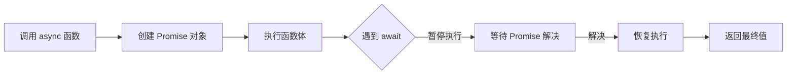

### async/await 的本质：用同步语法书写异步逻辑

**核心原理**：`async/await` 是 Promise 的语法糖，通过 **Generator + 自动执行器** 实现，将异步操作转化为类似同步的代码结构，但**底层仍是异步执行**。

---

### 一、同步化表达异步操作的关键特性

#### 1. 代码结构同步化
```javascript
// 异步操作同步写法
async function fetchUserData() {
  try {
    const token = await getToken();      // 等待异步操作
    const user = await getUser(token);   // 使用上一步结果
    const posts = await getPosts(user.id);
    
    return { user, posts };             // 返回最终结果
  } catch (error) {
    console.error('请求失败:', error);
  }
}

// 等效的 Promise 链
function fetchUserData() {
  return getToken()
    .then(token => getUser(token))
    .then(user => getPosts(user.id))
    .then(posts => ({ user, posts }))
    .catch(error => console.error('请求失败:', error));
}
```

#### 2. 错误处理同步化
```javascript
// 同步风格的 try/catch
async function updateCart() {
  try {
    const inventory = await checkInventory();
    if (inventory.stock > 0) {
      await addToCart();
      return '添加成功';
    }
  } catch (err) {
    // 统一捕获所有 await 错误
    logError(err);
    return '库存检查失败';
  }
}
```

---

### 二、底层实现机制

#### 执行流程解析


#### 转译后的代码结构（Babel 编译结果）
```javascript
// async 函数
async function example() {
  await somePromise();
}

// 转译为 Generator 执行
function _example() {
  return _asyncToGenerator(function* () {
    yield somePromise(); // yield 暂停执行
  })();
}

function _asyncToGenerator(fn) {
  return function() {
    const gen = fn.apply(this, arguments);
    return new Promise((resolve, reject) => {
      function step(key, arg) {
        try {
          const { value, done } = gen[key](arg);
          if (done) resolve(value);
          else Promise.resolve(value).then(step.bind(null, 'next'), step.bind(null, 'throw'));
        } catch (err) {
          reject(err);
        }
      }
      step('next');
    });
  };
}
```

---

### 三、适用场景推荐

#### 1. 顺序依赖的异步操作
```javascript
// 有顺序依赖的API调用
async function processOrder(orderId) {
  const order = await fetchOrder(orderId);         // 1. 获取订单
  const payment = await processPayment(order);     // 2. 依赖订单支付
  await sendConfirmation(order, payment);          // 3. 发送确认
  return '订单完成';
}
```

#### 2. 复杂条件逻辑
```javascript
async function checkout() {
  const user = await getCurrentUser();
  const cart = await loadCart(user.id);
  
  if (cart.items.length === 0) {
    throw new Error('购物车为空');
  }
  
  if (user.isVIP) {
    await applyVipDiscount(user);
  }
  
  return submitOrder(cart);
}
```

#### 3. 循环中的异步操作
```javascript
// 顺序执行异步循环
async function batchProcess(items) {
  const results = [];
  for (const item of items) {
    const processed = await processItem(item); // 顺序执行
    results.push(processed);
  }
  return results;
}

// 并行执行（更高效）
async function parallelProcess(items) {
  const promises = items.map(item => processItem(item));
  return Promise.all(promises); // 并行执行
}
```

#### 4. 中间件处理（Node.js Koa）
```javascript
// Koa 中间件链
app.use(async (ctx, next) => {
  const start = Date.now();
  await next(); // 等待下游中间件
  const duration = Date.now() - start;
  ctx.set('X-Response-Time', `${duration}ms`);
});
```

---

### 四、注意事项与陷阱

#### 1. 性能陷阱
```javascript
// 错误：不必要的顺序等待
async function slowFetch() {
  const user = await fetch('/user');   // 等待完成
  const posts = await fetch('/posts'); // 才开始请求
  // 总耗时 = user耗时 + posts耗时
}

// 正确：并行请求
async function fastFetch() {
  const [user, posts] = await Promise.all([
    fetch('/user'),
    fetch('/posts')
  ]);
  // 总耗时 ≈ 较慢请求的耗时
}
```

#### 2. 上下文丢失问题
```javascript
class ApiClient {
  constructor() {
    this.token = null;
  }

  // 错误：箭头函数导致 this 丢失
  fetchData = async () => {
    await this.authenticate(); // this 指向错误！
  };

  // 正确：使用普通方法
  async fetchData() {
    await this.authenticate(); // this 正确指向实例
  }
}
```

#### 3. 错误处理边界
```javascript
// 危险：未捕获的拒绝
async function riskyOperation() {
  const data = await fetchData(); // 可能拒绝但未处理
  return process(data);
}

// 解决方案1：try/catch 包装
async function safeOperation() {
  try {
    const data = await fetchData();
    return process(data);
  } catch (err) {
    handleError(err);
  }
}

// 解决方案2：全局捕获
window.addEventListener('unhandledrejection', event => {
  console.error('未处理的Promise拒绝:', event.reason);
  event.preventDefault();
});
```

---

### 五、最佳实践指南

1. **避免过度序列化**  
   ```javascript
   // 推荐并行
   const [user, product] = await Promise.all([
     fetchUser(),
     fetchProduct()
   ]);
   ```

2. **顶级 await 使用**（ES2022+）  
   ```javascript
   // 模块顶层使用
   const config = await loadConfig();
   export const api = createAPI(config);
   ```

3. **明确错误传播**  
   ```javascript
   async function main() {
     const data = await fetchData().catch(err => {
       // 本地处理部分错误
       if (err.code === 404) return fallbackData;
       throw err; // 重新抛出其他错误
     });
   }
   ```

4. **与 Promise 混合使用**  
   ```javascript
   async function getData() {
     return fetchData()  // 直接返回Promise
       .then(data => transform(data))
       .catch(err => recoverFromError(err));
   }
   ```

> **核心价值**：  
> async/await 通过 **暂停-恢复机制**（基于生成器），实现了：  
> 1. **线性代码流** - 告别回调地狱  
> 2. **同步错误处理** - try/catch 统一捕获  
> 3. **逻辑表达清晰** - 条件/循环直观处理  
>   
> 但需谨记：**它只是语法糖，并未改变JavaScript异步运行的本质**，滥用仍可能导致性能问题。