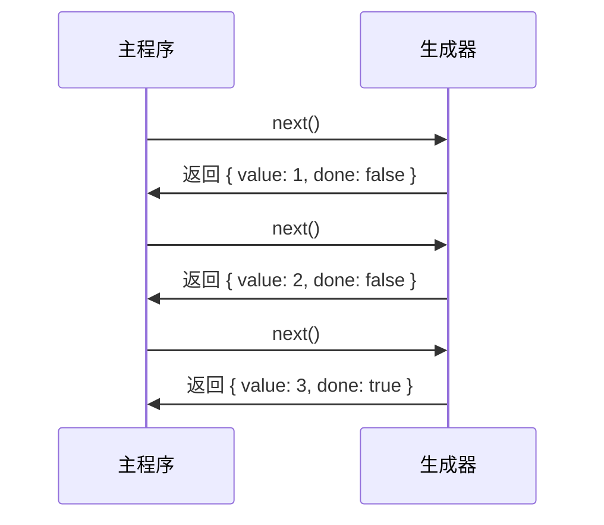
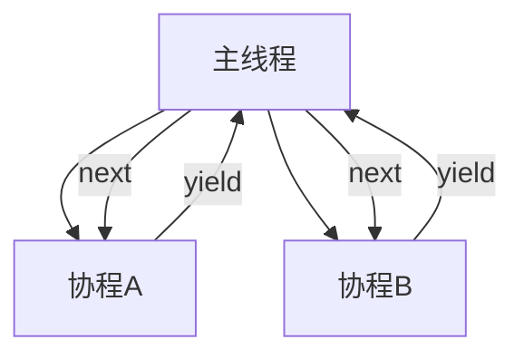

### Generator 实现原理深度解析

Generator 的核心是**协程（Coroutine）** 和**状态机（State Machine）** 的结合，通过暂停/恢复执行上下文实现异步流程控制。

---

#### 一、核心概念
1. **协程（Coroutine）**
   - 比线程更轻量的执行单元
   - 可主动让出 CPU 控制权（`yield`）
   - 可被外部恢复执行（`next()`）

2. **执行上下文（Execution Context）**
   - 包含变量环境、词法环境、this 绑定等
   - Generator 暂停时保存完整上下文

---

### 二、底层实现机制
#### 1. 状态机转换
```javascript
function* gen() {
  yield 1;
  yield 2;
  return 3;
}

// Babel 转译结果（简化）
var _gen = regeneratorRuntime.mark(function gen() {
  return regeneratorRuntime.wrap(
    function gen$(_context) {
      while (1) {
        switch (_context.prev = _context.next) {
          case 0:
            _context.next = 2;
            return 1;
          case 2:
            _context.next = 4;
            return 2;
          case 4:
            return _context.abrupt("return", 3);
          case 5:
          case "end":
            return _context.stop();
        }
      }
    },
    gen
  );
});
```

#### 2. 执行上下文保存
```mermaid
graph LR
A[调用 gen()] --> B[创建生成器对象]
B --> C[创建上下文对象]
C -->|保存| D[局部变量]
C -->|保存| E[指令指针]
C -->|保存| F[作用域链]
```

#### 3. 控制权转移流程


---

### 三、关键数据结构
#### 生成器对象结构
```javascript
GeneratorObject = {
  [[Prototype]]: GeneratorPrototype,
  [[GeneratorState]]: "suspended" | "executing" | "completed",
  [[GeneratorContext]]: ExecutionContext,
  [[GeneratorBrand]]: 内部标识
}
```

#### 上下文对象
```javascript
ExecutionContext = {
  prev: 前一个状态,
  next: 下一个状态,
  sent: 传入的值,
  abrupt: 终止类型(return/throw),
  method: 当前方法,
  tryLoc: try/catch位置信息,
  // ...其他元数据
}
```

---

### 四、核心操作原理解析
#### 1. `next()` 方法实现
```javascript
function next(value) {
  // 1. 恢复保存的上下文
  restoreContext(this._context);
  
  // 2. 注入传入值
  if (arguments.length > 0) {
    this._context.sent = value;
  }
  
  // 3. 执行到下一个 yield/return
  const result = executeGenerator(this._context);
  
  // 4. 暂停时保存上下文
  if (result.done) {
    this._state = "completed";
  } else {
    saveContext(this._context);
  }
  
  return { value: result.value, done: result.done };
}
```

#### 2. `yield` 工作原理
```javascript
function yield(value) {
  // 1. 保存当前执行状态
  const context = getCurrentContext();
  saveContext(context);
  
  // 2. 返回控制权给调用者
  return {
    value: value,
    done: false
  };
}
```

#### 3. 错误传播机制
```javascript
function throw(err) {
  if (this._state === "suspended") {
    // 在暂停位置抛出错误
    const context = this._context;
    context.abrupt = "throw";
    context.exception = err;
    return next.call(this);
  }
  throw err; // 非暂停状态直接抛出
}
```

---

### 五、协程调度模型


---

### 六、Generator 与异步应用
#### 实现 async/await 的基石
```javascript
// async/await 转译为 Generator
async function fetchData() {
  const res = await fetch('/data');
  return res.json();
}

// 转译结果
function fetchData() {
  return _asyncToGenerator(function* () {
    const res = yield fetch('/data');
    return res.json();
  })();
}

function _asyncToGenerator(fn) {
  return function() {
    const gen = fn.apply(this, arguments);
    return new Promise((resolve, reject) => {
      function step(key, arg) {
        try {
          const { value, done } = gen[key](arg);
          if (done) resolve(value);
          else Promise.resolve(value).then(step.bind(null, 'next'), step.bind(null, 'throw'));
        } catch (err) {
          reject(err);
        }
      }
      step('next');
    });
  };
}
```

---

### 七、性能优化策略
1. **惰性求值**
   ```javascript
   function* bigData() {
     for (let i = 0; i < 1e6; i++) {
       yield processItem(i); // 按需处理
     }
   }
   ```

2. **内存管理**
   ```javascript
   function* process() {
     // 及时释放大对象
     const data = loadHugeData();
     yield processPart(data);
     data = null; // 手动解除引用
     // ...
   }
   ```

3. **避免深度嵌套**
   ```javascript
   // 错误：嵌套生成器
   function* nested() {
     yield* anotherGen(); // 可能导致调用栈溢出
   }
   
   // 正确：扁平化处理
   function* flat() {
     const gen = anotherGen();
     let result = gen.next();
     while (!result.done) {
       yield result.value;
       result = gen.next();
     }
   }
   ```

---

### 八、V8 引擎优化
1. **隐藏类优化**
   - 为 Generator 对象创建固定隐藏类
   - 加速属性访问

2. **内联缓存（IC）**
   - 缓存 `next()` 方法的类型反馈
   - 减少多态调用开销

3. **逃逸分析**
   - 检测未逃逸的 Generator 对象
   - 在栈上分配而非堆中

> **性能数据**：  
> 现代 JS 引擎中 Generator 调用开销 ≈ 普通函数调用的 1.5 倍

---

### 总结：Generator 本质
1. **有栈协程实现**：通过完整保存执行上下文
2. **状态机转换**：使用 switch-case 管理 yield 节点
3. **控制反转**：将执行流程控制权交给调用方
4. **惰性执行**：按需生成值序列

```mermaid
graph LR
A[Generator函数] --> B[创建状态机]
B --> C[返回迭代器对象]
C --> D[next()触发执行]
D --> E[执行到yield暂停]
E --> F[保存上下文]
F --> D
```