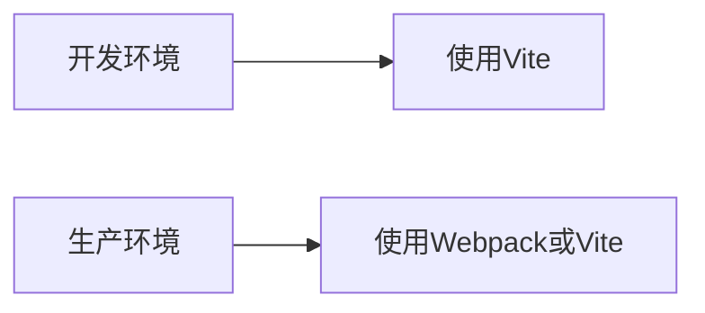
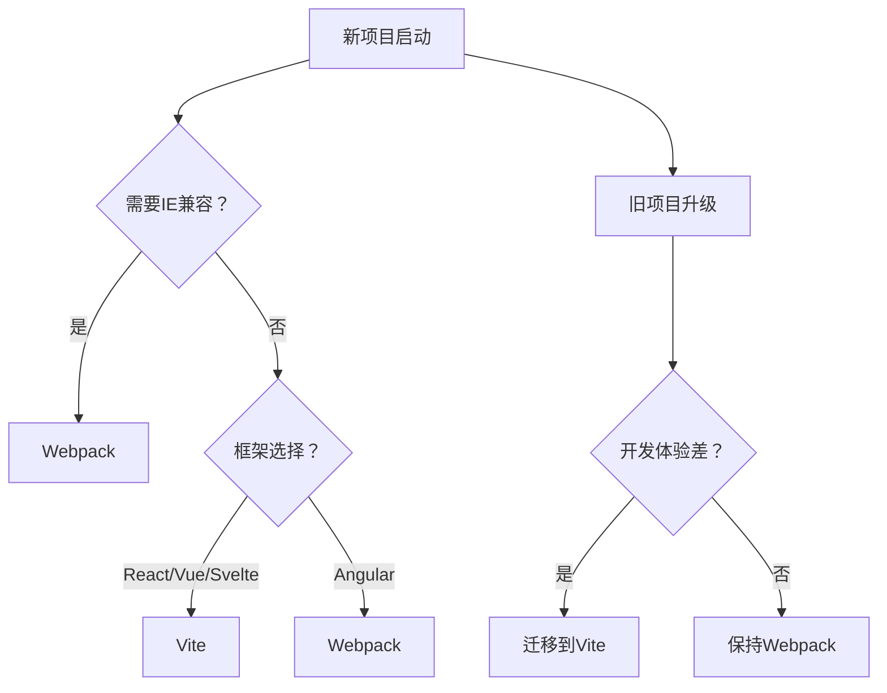

# Webpack 与 Vite 配置详解

## 一、Webpack 核心配置

### 1. 基础配置结构
```javascript
// webpack.config.js
const path = require('path');
const HtmlWebpackPlugin = require('html-webpack-plugin');
const MiniCssExtractPlugin = require('mini-css-extract-plugin');

module.exports = {
  // 入口文件配置
  entry: {
    main: './src/index.js',
    vendor: ['react', 'react-dom']
  },
  
  // 输出配置
  output: {
    filename: '[name].[contenthash].bundle.js',
    path: path.resolve(__dirname, 'dist'),
    clean: true,
    publicPath: '/'
  },
  
  // 开发服务器
  devServer: {
    static: './dist',
    hot: true,
    port: 3000,
    historyApiFallback: true,
    proxy: {
      '/api': 'http://localhost:8080'
    }
  },
  
  // 模块解析规则
  module: {
    rules: [
      // Babel 处理 JS
      {
        test: /\.(js|jsx)$/,
        exclude: /node_modules/,
        use: {
          loader: 'babel-loader',
          options: {
            presets: ['@babel/preset-env', '@babel/preset-react']
          }
        }
      },
      
      // CSS 处理
      {
        test: /\.css$/i,
        use: [
          MiniCssExtractPlugin.loader, 
          'css-loader',
          'postcss-loader'
        ]
      },
      
      // 图片资源
      {
        test: /\.(png|svg|jpg|jpeg|gif)$/i,
        type: 'asset/resource',
        generator: {
          filename: 'images/[hash][ext][query]'
        }
      }
    ]
  },
  
  // 插件配置
  plugins: [
    new HtmlWebpackPlugin({
      template: './public/index.html',
      favicon: './public/favicon.ico'
    }),
    new MiniCssExtractPlugin({
      filename: 'styles/[name].[contenthash].css'
    })
  ],
  
  // 优化配置
  optimization: {
    splitChunks: {
      chunks: 'all',
      cacheGroups: {
        vendor: {
          test: /[\\/]node_modules[\\/]/,
          name: 'vendors',
          chunks: 'all'
        }
      }
    },
    runtimeChunk: 'single'
  },
  
  // 解析配置
  resolve: {
    extensions: ['.js', '.jsx', '.json'],
    alias: {
      '@': path.resolve(__dirname, 'src/'),
      components: path.resolve(__dirname, 'src/components/')
    }
  },
  
  // 开发模式配置
  mode: process.env.NODE_ENV || 'development',
  devtool: 'source-map'
};
```

### 2. 高级优化配置
```javascript
// webpack.prod.js
const { merge } = require('webpack-merge');
const TerserPlugin = require('terser-webpack-plugin');
const CssMinimizerPlugin = require('css-minimizer-webpack-plugin');
const baseConfig = require('./webpack.config');

module.exports = merge(baseConfig, {
  mode: 'production',
  devtool: false,
  
  optimization: {
    minimize: true,
    minimizer: [
      new TerserPlugin({
        parallel: true,
        terserOptions: {
          compress: {
            drop_console: true
          }
        }
      }),
      new CssMinimizerPlugin()
    ],
    
    // 更精细的代码分割
    splitChunks: {
      chunks: 'all',
      minSize: 20000,
      maxSize: 70000,
      minChunks: 1,
      maxAsyncRequests: 30,
      maxInitialRequests: 30,
      automaticNameDelimiter: '~',
      cacheGroups: {
        defaultVendors: {
          test: /[\\/]node_modules[\\/]/,
          priority: -10,
          reuseExistingChunk: true
        },
        default: {
          minChunks: 2,
          priority: -20,
          reuseExistingChunk: true
        }
      }
    }
  },
  
  performance: {
    hints: 'warning',
    maxAssetSize: 500000,
    maxEntrypointSize: 500000
  }
});
```

### 3. 常用Loader和插件
| **类型**       | **工具**                  | **用途**                     |
|----------------|---------------------------|------------------------------|
| **Loader**     | babel-loader              | ES6+转译                     |
|                | ts-loader                 | TypeScript编译               |
|                | css-loader               | 解析CSS依赖                  |
|                | style-loader              | 注入CSS到DOM                 |
|                | sass-loader               | 编译SASS/SCSS                |
|                | file-loader               | 处理文件资源                 |
| **Plugin**     | HtmlWebpackPlugin         | 生成HTML文件                 |
|                | MiniCssExtractPlugin      | 提取CSS到单独文件            |
|                | CleanWebpackPlugin        | 构建前清理dist目录           |
|                | CopyWebpackPlugin         | 复制静态资源                 |
|                | DefinePlugin              | 定义环境变量                 |
| **优化插件**   | TerserPlugin             | JS代码压缩                   |
|                | CssMinimizerPlugin       | CSS代码压缩                  |
|                | CompressionPlugin        | Gzip/Brotli压缩              |

## 二、Vite 核心配置

### 1. 基础配置结构
```javascript
// vite.config.js
import { defineConfig } from 'vite';
import react from '@vitejs/plugin-react';
import { visualizer } from 'rollup-plugin-visualizer';

export default defineConfig(({ command, mode }) => {
  const isProd = command === 'build';
  
  return {
    // 项目根目录
    root: './src',
    
    // 公共基础路径
    base: isProd ? '/production-path/' : '/',
    
    // 构建选项
    build: {
      outDir: '../dist',
      assetsDir: 'static',
      emptyOutDir: true,
      sourcemap: true,
      minify: 'terser',
      rollupOptions: {
        output: {
          manualChunks: (id) => {
            if (id.includes('node_modules')) {
              return 'vendor';
            }
          },
          chunkFileNames: 'static/js/[name]-[hash].js',
          entryFileNames: 'static/js/[name]-[hash].js',
          assetFileNames: 'static/assets/[name]-[hash].[ext]'
        }
      },
      terserOptions: {
        compress: {
          drop_console: true
        }
      }
    },
    
    // 插件系统
    plugins: [
      react(),
      visualizer({
        open: true,
        filename: 'bundle-stats.html'
      })
    ],
    
    // 开发服务器
    server: {
      port: 3000,
      open: true,
      proxy: {
        '/api': {
          target: 'http://localhost:8080',
          changeOrigin: true,
          rewrite: (path) => path.replace(/^\/api/, '')
        }
      }
    },
    
    // 解析配置
    resolve: {
      alias: {
        '@': path.resolve(__dirname, 'src'),
        components: '/src/components'
      }
    },
    
    // CSS配置
    css: {
      modules: {
        localsConvention: 'camelCase'
      },
      preprocessorOptions: {
        scss: {
          additionalData: `@import "@/styles/variables.scss";`
        }
      }
    },
    
    // 环境变量配置
    define: {
      __APP_VERSION__: JSON.stringify(process.env.npm_package_version)
    },
    
    // 预览配置
    preview: {
      port: 5000,
      strictPort: true
    }
  };
});
```

### 2. 高级配置技巧
```javascript
// 环境特定配置
import { loadEnv } from 'vite';

export default defineConfig(({ mode }) => {
  const env = loadEnv(mode, process.cwd());
  
  return {
    // 条件配置
    plugins: env.VITE_ANALYZE ? [visualizer()] : [],
    
    // 环境变量注入
    define: {
      'process.env': env
    },
    
    // SSR配置
    ssr: {
      target: 'node',
      format: 'cjs'
    },
    
    // Worker配置
    worker: {
      format: 'es',
      plugins: [react()]
    },
    
    // 依赖优化
    optimizeDeps: {
      include: ['react', 'react-dom'],
      exclude: ['vue'],
      force: true
    },
    
    // 自定义中间件
    server: {
      middlewareMode: true,
      fs: {
        strict: false
      },
      configureServer: (server) => {
        server.middlewares.use((req, res, next) => {
          // 自定义请求处理
          next();
        });
      }
    }
  };
});
```

### 3. Vite 特色功能配置
```javascript
// 多页面应用配置
build: {
  rollupOptions: {
    input: {
      main: path.resolve(__dirname, 'index.html'),
      admin: path.resolve(__dirname, 'admin.html')
    }
  }
}

// 动态导入配置
build: {
  rollupOptions: {
    output: {
      manualChunks: {
        react: ['react', 'react-dom'],
        lodash: ['lodash']
      }
    }
  }
}

// WASM支持
import wasm from 'vite-plugin-wasm';

plugins: [
  wasm()
]

// 文件系统路由
import Pages from 'vite-plugin-pages';

plugins: [
  Pages({
    dirs: 'src/pages',
    exclude: ['**/components/**']
  })
]
```

## 三、配置对比分析

### 1. 架构设计对比
| **特性**         | Webpack                     | Vite                        |
|------------------|-----------------------------|-----------------------------|
| **构建原理**     | 基于打包器（Bundle-based） | 基于ESM原生支持（ESM-based）|
| **开发启动**     | 全量打包后启动              | 按需编译+原生ESM加载        |
| **HMR速度**      | 随项目增大而变慢            | 极快（毫秒级响应）          |
| **生产构建**     | 成熟稳定                    | Rollup驱动，同样强大        |
| **配置复杂度**   | 高（需多loader/plugin组合）| 低（开箱即用）              |

### 2. 性能对比数据
| **指标**         | Webpack (10万行项目) | Vite (10万行项目) |
|------------------|----------------------|-------------------|
| **冷启动时间**   | 12-25秒              | 0.5-3秒           |
| **HMR更新时间**  | 1-5秒                | 50-200毫秒        |
| **内存占用**     | 1.2-2.5GB            | 300-800MB         |
| **生产构建时间** | 45-90秒              | 30-60秒           |

### 3. 适用场景推荐
| **场景**                     | **推荐工具** | **原因**                      |
|------------------------------|--------------|-------------------------------|
| 大型企业级应用               | Webpack      | 生态完善，兼容性好            |
| 现代框架快速开发（Vue/React）| Vite         | 开发体验极佳                  |
| 需要兼容旧浏览器             | Webpack      | 更好的polyfill支持            |
| 库/组件开发                  | Vite         | 轻量快速，支持多种输出格式    |
| SSR应用                      | 两者皆可     | Webpack更成熟，Vite开发更快   |
| 微前端架构                   | Webpack      | Module Federation支持更好     |

## 四、最佳实践方案

### 1. 混合使用策略（推荐）


### 2. Webpack迁移Vite指南
1. **安装基础依赖**：
   ```bash
   npm install vite @vitejs/plugin-react vite-plugin-html -D
   ```

2. **创建vite.config.js**：
   ```javascript
   import { defineConfig } from 'vite';
   import react from '@vitejs/plugin-react';
   
   export default defineConfig({
     plugins: [react()],
     build: {
       rollupOptions: {
         output: {
           manualChunks: {
             react: ['react', 'react-dom'],
             vendor: ['lodash', 'moment']
           }
         }
       }
     }
   });
   ```

3. **修改package.json**：
   ```json
   {
     "scripts": {
       "dev": "vite",
       "build": "vite build",
       "preview": "vite preview"
     }
   }
   ```

4. **处理常见问题**：
   - 替换`require`为`import`
   - 使用`public`目录存放静态资源
   - 将`process.env`替换为`import.meta.env`
   - 处理CSS模块导入方式

### 3. 通用优化技巧
**Webpack优化**：
```javascript
// 使用持久化缓存
cache: {
  type: 'filesystem',
  buildDependencies: {
    config: [__filename]
  }
}

// 使用SWC加速构建
{
  test: /\.(js|jsx)$/,
  use: {
    loader: 'swc-loader'
  }
}
```

**Vite优化**：
```javascript
// 预构建优化
optimizeDeps: {
  include: [
    'react',
    'react-dom',
    'lodash-es'
  ],
  exclude: ['vue']
}

// 异步加载优化
build: {
  rollupOptions: {
    output: {
      experimentalMinChunkSize: 10000
    }
  }
}
```

### 4. 现代化配置趋势
1. **零配置框架**：
   - Next.js（基于Webpack）
   - Nuxt 3（基于Vite）
   - Remix（基于ESBuild）

2. **构建工具混合使用**：
   ```javascript
   // 使用Vite开发 + ESBuild生产压缩
   build: {
     minify: 'esbuild',
     target: 'esnext'
   }
   ```

3. **基于Bundle-less的架构**：
   ```javascript
   // Vite配置
   server: {
     fs: {
       strict: false,
       allow: ['..', '../../node_modules']
     }
   }
   ```

## 五、配置选择决策树


> **最终建议**：  
> - 新项目首选Vite，享受极速开发体验  
> - 大型企业级项目使用Webpack更稳妥  
> - 混合使用策略：开发用Vite，生产用Webpack  
> - 关注新兴工具（如Turbopack、Rspack）的发展