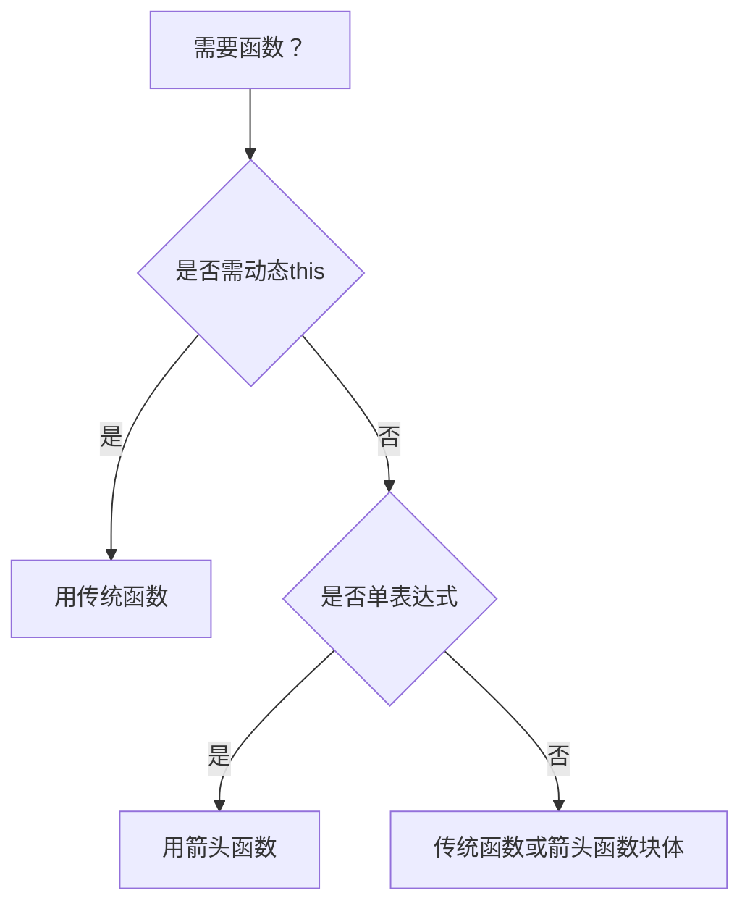

### 箭头函数的最佳应用场景

箭头函数在以下场景中表现出色，能显著提升代码质量和开发体验：

---

#### 一、需要绑定词法作用域的场景
**核心优势**：自动捕获外层 `this` 上下文  
**传统函数痛点**：需要 `.bind(this)` 或 `that = this`  
```javascript
// 类方法中的回调
class SearchBar {
  constructor() {
    this.query = "";
    // 箭头函数自动绑定 this
    this.input.addEventListener('input', () => {
      this.filterResults(this.query); // 正确指向实例
    });
  }
}

// React 类组件
class Button extends React.Component {
  handleClick = () => { // 类属性 + 箭头函数
    console.log(this.props); // 无需 bind
  }
}
```

---

#### 二、函数式编程操作
**核心优势**：简洁的链式调用  
**典型场景**：数组方法链式操作  
```javascript
// 数据处理管道
const results = data
  .filter(item => item.active)           // 箭头函数简化
  .map(({ id, name }) => ({ id, name })) // 解构 + 简写
  .sort((a, b) => a.name.localeCompare(b.name));
```

---

#### 三、Promise 链式调用
**核心优势**：保持上下文一致性  
```javascript
fetch('/api/data')
  .then(response => response.json()) // 自动返回
  .then(data => {
    this.process(data); // this 正确指向
    return data.length;
  })
  .catch(error => console.error(error));
```

---

#### 四、立即执行函数 (IIFE)
**核心优势**：更简洁的封装  
```javascript
// 传统 IIFE
(function() {
  const privateVar = 42;
})();

// 箭头函数 IIFE
(() => {
  const privateVar = 42; // 更简洁
})();
```

---

#### 五、返回对象字面量
**核心优势**：单表达式直接返回  
```javascript
// 传统方式
const makeUser = (id) => {
  return { id: id, role: 'member' };
};

// 箭头函数简化
const makeUser = id => ({ id, role: 'member' }); // 注意括号包裹
```

---

#### 六、高阶函数参数
**核心优势**：减少嵌套层级  
```javascript
// 传统回调金字塔
setTimeout(function() {
  getData(function(result) {
    render(result);
  });
}, 1000);

// 箭头函数扁平化
setTimeout(() => getData(result => render(result)), 1000);
```

---

#### 七、类型系统友好 (TypeScript)
**核心优势**：自动类型推断  
```typescript
// 自动推断参数类型
const users = users.map(user => ({
  ...user,
  fullName: `${user.firstName} ${user.lastName}`
}));
// user 自动获得 User 类型
```

---

### 应避免使用箭头函数的场景

#### 1. 对象方法定义
```javascript
const counter = {
  count: 0,
  increment: () => {
    this.count++; // 错误！this 指向外层（通常是 window）
  }
};
```

#### 2. 构造函数
```javascript
const Person = () => {};
const p = new Person(); // TypeError: Person is not a constructor
```

#### 3. 需要 arguments 对象
```javascript
const sum = () => {
  console.log(arguments); // 引用外层 arguments
};

function traditionalSum() {
  console.log(arguments); // 正确获取参数
}
```

#### 4. 事件处理器需要动态 this
```javascript
button.addEventListener('click', () => {
  console.log(this); // 指向组件实例（可能错误）
  console.log(event.target); // 需要显式传递 event
});

// 正确做法
button.addEventListener('click', function(event) {
  console.log(this); // 指向 button 元素
  console.log(event.target); // 直接访问
});
```

---

### 性能注意事项
| 场景                 | 箭头函数 | 传统函数 | 说明 |
|----------------------|----------|----------|------|
| 小规模循环 (1e4)     | ≈1.2x    | 基准     | 可忽略 |
| 大型类库初始化       | 优       | 良       | 无绑定开销 |
| 热代码路径           | 优       | 良       | 解析更快 |
| 需要函数提升         | 不可用   | 可用     | 箭头函数不会提升 |

> **最佳实践总结**：  
> 1. 优先在**回调函数**、**Promise链**、**函数式操作**中使用箭头函数  
> 2. 避免在**对象方法**、**构造函数**、**原型方法**中使用  
> 3. 在 React/Vue 组件中：  
>    - **类组件**：用箭头函数定义方法  
>    - **函数组件**：直接用箭头函数声明组件  
> 4. TypeScript 中充分利用箭头函数的类型推断优势  

