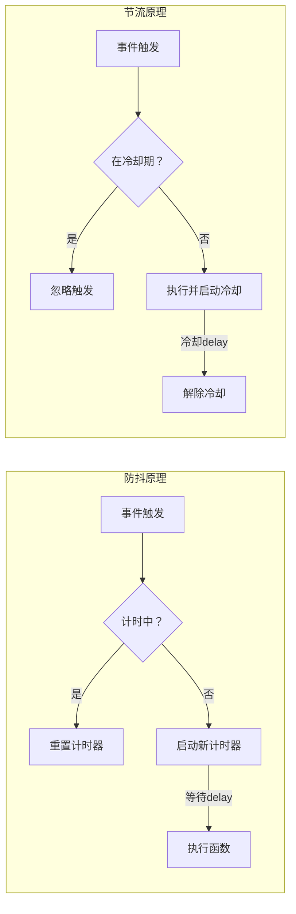

### 🔥 节流与防抖终极解析（四维框架）
---

#### 1️⃣ **本质透视镜**
|  | 本质定义（12字内） | 核心差异 |
| --- | --- | --- |
| **防抖** | `高频事件终止后触发` | **等待静止** |
| **节流** | `高频事件固定间隔触发` | **均匀稀释** |


> **验证压缩**：  
>
> + 防抖：电梯关门（最后一人进入后等待N秒关门）  
> + 节流：水龙头滴水（无论手抖多快，固定每秒1滴）
>

---

#### 2️⃣ **关系拓扑图**


---

#### 3️⃣ **行动意义锚点**
|  | 核心价值 | 必要性 | 量化收益案例 |
| --- | --- | --- | --- |
| **防抖** | `避免无效高频操作` | 防止搜索框输入抖动频繁请求 | 减少70% API请求 |
| **节流** | `保证操作流畅可控` | 防止滚动事件卡顿 | 降低90% 滚动事件CPU占用 |


---

#### 4️⃣ **步骤拆解器**
##### 防抖实现（基础版）
```javascript
function debounce(func, delay) {
  let timer; // ① 声明计时器容器
  
  return function(...args) {
    // ② 清除已有计时器（关键重置）
    clearTimeout(timer); 
    
    // ③ 启动新计时器
    timer = setTimeout(() => {
      func.apply(this, args); // ④ 最终执行
    }, delay);
  };
}
```

**避坑点**：`func.apply(this)` 保持正确上下文

##### 节流实现（时间戳版）
```javascript
function throttle(func, delay) {
  let lastTime = 0; // ① 记录上次执行时间
  
  return function(...args) {
    const now = Date.now();
    
    // ② 检查是否达到时间间隔
    if (now - lastTime >= delay) {
      func.apply(this, args); // ③ 执行函数
      lastTime = now; // ④ 更新执行时间
    }
  };
}
```

**避坑点**：尾事件处理（时间戳版会忽略最后一次触发）

---

### 🆚 核心差异对比表
| 特性 | 防抖 | 节流 |
| --- | --- | --- |
| **执行时机** | 事件停止后延迟执行 | 固定时间间隔执行 |
| **执行次数** | 只执行最后一次 | 周期性执行 |
| **响应速度** | 延迟响应（等待静止） | 即时首响应+周期响应 |
| **内存占用** | 需维护计时器 | 只需存储时间戳 |
| **适用场景** | 搜索建议/窗口resize/文本验证 | 滚动事件/游戏射击/拖拽操作 |


---

### 💡 进阶实现方案
#### 防抖加强版（立即执行 + 尾执行）
```javascript
function debouncePlus(func, delay, immediate = false) {
  let timer;
  
  return function(...args) {
    const context = this;
    
    // 立即执行模式
    if (immediate && !timer) {
      func.apply(context, args);
    }
    
    clearTimeout(timer);
    timer = setTimeout(() => {
      timer = null;
      // 非立即模式执行尾部
      if (!immediate) func.apply(context, args);
    }, delay);
  };
}
```

#### 节流加强版（结合时间戳+定时器）
```javascript
function throttlePlus(func, delay) {
  let lastTime = 0;
  let timer;
  
  return function(...args) {
    const context = this;
    const now = Date.now();
    const remaining = delay - (now - lastTime);

    clearTimeout(timer);
    
    if (remaining <= 0) {
      func.apply(context, args);
      lastTime = now;
    } else {
      // 保证尾事件执行
      timer = setTimeout(() => {
        func.apply(context, args);
        lastTime = Date.now();
      }, remaining);
    }
  };
}
```

---

### 🌐 真实场景应用
#### 防抖实战（搜索建议）
```javascript
const searchInput = document.getElementById('search');
const fetchSuggestions = debouncePlus(async (query) => {
  const res = await fetch(`/suggest?q=${query}`);
  showSuggestions(await res.json());
}, 300, true); // 立即执行首字母搜索
```

#### 节流实战（无限滚动）
```javascript
window.addEventListener('scroll', throttlePlus(() => {
  if (window.innerHeight + window.scrollY >= document.body.offsetHeight - 500) {
    loadMoreContent();
  }
}, 200)); // 200ms间隔检查
```

> **终极结论**：  
>
> + 防抖 = **等待动作完成**（适合结果型操作）  
> + 节流 = **控制执行频率**（适合过程型操作）  
两者都利用闭包保存状态，是高频事件优化的核心工具。
>

