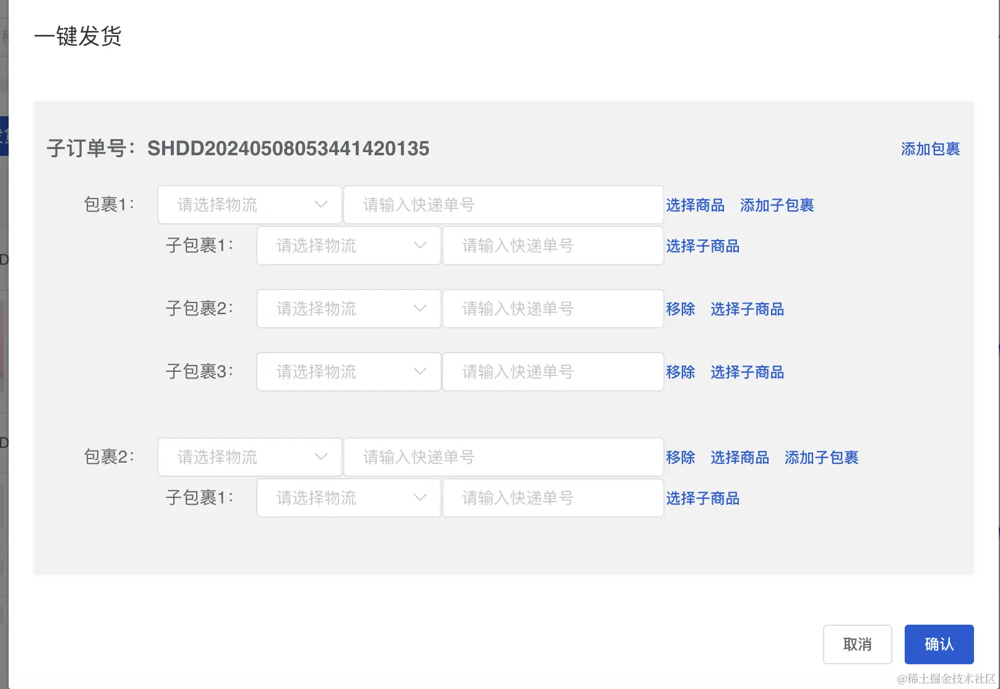

说点废话，最近在做一个重构的项目。我感觉学不到东西，业务也就那样。这个简单的我感觉要是之前的我。我就很快做出来了，这次我做了相对久了。很难受。吐槽一下吧，这个项目代码经过很多人说是屎山也不为过。但是搭建确实做的很好，应该仔细研究学习一下。
##### 上成品



#### 数据格式
这次做的久很大一部分原因是我直接就做了，并没有考虑数据，在做着做着就会出现很问题。开发很重要一点先定义数据，再根据数据生成相应的页面。
错误的原因是一开始取巧了打算利用subOrdershoppingList 里面有的数据作为shoppingShow 展示的数据在这里所以在显示开发的时候总有些问题。没有设计数据格式，打算利用subOrdershoppingLis反而浪费了很多时间。
```javascript

[
  {
    "interfaceSubOrderId": "1",
    "subOrderName": "子订单1",
    "subOrdershoppingList": [],
    "interfaceOrderId": "1",
    "parentOrderName": "父订单1",
    "packageList": [
      {
        "expressName": "",
        "expressNo": "",
        "expressCode": "",
        "shoppingShow": [],
        "packageChildren": [
          {
            "expressName": "",
            "expressNo": "",
            "expressCode": "",
            "shoppingShowChildren": []
          },
          {
            "expressName": "",
            "expressNo": "",
            "expressCode": "",
            "shoppingShowChildren": []
          },
          {
            "expressName": "",
            "expressNo": "",
            "expressCode": "",
            "shoppingShowChildren": []
          }
        ]
      },
      {
        "expressName": "",
        "expressNo": "",
        "expressCode": "",
        "shoppingShow": [],
        "packageChildren": [
          {
            "expressName": "",
            "expressNo": "",
            "expressCode": "",
            "shoppingShowChildren": []
          }
        ]
      },
 

    ]
  }
] 


```
#### 页面展示
```vue
<el-dilog :title="title" v-model="modelValue" @close="closeGroup">
      <div
        class="select-table-main"
        v-for="v in deliverGoodsData.newGoodList"
        :key="v.interfaceSubOrderId"
      >
        <div class="select-table-title">
          <h3>子订单号：{{ v.interfaceSubOrderId }}</h3>

          <el-button type="text" @click="addGroup(v.interfaceSubOrderId)"
            >添加包裹</el-button
          >

        </div>

        <el-form label-width="80px" class="form-detail">
          <el-form-item
            :label="'包裹' + (index + 1) + '：'"
            v-for="(item, index) in v.packageList"
            :key="index"
          >
            <el-select
              style="display: inline-block; width: 150px; margin-left: 10px"
              v-model="item.expressName"
              placeholder="请选择物流"
              filterable
            >
              <el-option
                v-for="it in deliverGoodsData.expressCompanyList"
                :label="it.dictValue"
                :value="it.dictValue"
                :key="it.dictValue"
              ></el-option>

            </el-select>

            <el-input
              style="display: inline-block; width: 260px"
              v-model="item.expressNo"
              placeholder="请输入快递单号"
            ></el-input>

            <el-button v-if="index != 0" type="text" @click="ycFun(index)"
              >移除</el-button
            >

            <el-button
              type="text"
              @click="
                handleSelectGood({
                  pitchShopIndex: index,
                  type: null,
                  data: v.subOrdershoppingList,
                })
              "
              >选择商品</el-button
            >

            <el-button
              type="text"
              @click="addDeliver(index, v.interfaceSubOrderId)"
              >添加子包裹</el-button
            >

            <div>
              <div
                v-for="sle in item.shoppingShow"
                :key="sle.id"
                style="margin-left: 10px; font-size: 12px; color: gray"
              >
                <div v-if="sle.number">
                  {{ sle.showTitle }}&nbsp;&nbsp; {{ sle.specsName }}*{{
                    sle.number
                  }}
                </div>

              </div>

            </div>


            <el-form-item
              :label="'子包裹' + (subindex + 1) + '：'"
              v-for="(pac, subindex) in item.packageChildren"
              :key="subindex"
            >
              <el-select
                style="display: inline-block; width: 150px; margin-left: 10px"
                v-model="pac.expressName"
                placeholder="请选择物流"
                filterable
              >
                <el-option
                  v-for="exp in deliverGoodsData.expressCompanyList"
                  :label="exp.dictValue"
                  :value="exp.dictValue"
                  :key="exp.dictValue"
                ></el-option>

              </el-select>

              <el-input
                style="display: inline-block; width: 180px"
                v-model="pac.expressNo"
                placeholder="请输入快递单号"
              ></el-input>

              <el-button
                v-if="subindex != 0"
                type="text"
                @click="subYcFun(index, subindex)"
                >移除</el-button
              >

              <el-button
                type="text"
                @click="
                  handleSelectGood({
                    pitchShopIndex: index,
                    subPitchShopIndex: subindex,
                    type: 'sub',
                    data: v.subOrdershoppingList,
                  })
                "
                >选择子商品</el-button
              >

              <div
                v-for="subSle in pac.shoppingShowChildren"
                :key="subSle.id"
                style="margin-left: 10px; font-size: 12px; color: gray"
              >
                <div v-if="subSle.number">
                  {{ subSle.showTitle }}&nbsp;&nbsp; {{ subSle.specsName }}*{{
                    subSle.number
                  }}
                </div>

              </div>

            </el-form-item>

          </el-form-item>

        </el-form>

      </div>

      <template #footer>
        <div class="dialog-footer">
          <el-button type="default" @click="closeGroup">取消</el-button>

          <el-button type="primary" @click="submit">确认</el-button>

        </div>

      </template>

    </el-dilog>

```
其实这个现在想想很简单只要维护packageList就可以了。期间遇到一个问题在改变数据的时候不回显，这个项目用的是vue3 确是vue2和vue3混合写很恶心。我又全删了重新写的vue3.
在vue2 使用$set 解决    在vue3直接使用 reactive就可以了 computed 并不会随着数组更新而影响视图变化
```javascript

const deliverGoodsData = reactive({
  expressCompanyList: [], // 快递公司列表
  subDeliver: false,
  tableGoods: [],
  newGoodList: [],
  pitchShopIndex: null,
  subPitchShopIndex: null,
})

const selectGoodsRef = ref()

const props = defineProps({
  modelValue: Boolean,
  rowData: {
    type: Object,
    default: function () {
      return {}
    },
  },
  title: {
    type: String,
    default: function () {
      return '订单发货'
    },
  },
  opeType: {
    //操作类型 delivery发货，changeEms变更物流
    type: String,
    default: function () {
      return 'delivery'
    },
  },
  sendType: {
    //发货 send 与 变更发货状态 change(无移除，无添加包裹)
    type: String,
    default: function () {
      return 'send'
    },
  },
})

const emit = defineEmits(['updateTable', 'modelValue'])


watch(
  () => props.rowData,
  (newData, oldData) => {
    if (newData) {
      let newSubOrderList = newData.map((v) => v.interfaceSubOrderId)
      let arr = []
      newSubOrderList.map((v) => {
        newTableData.forEach((i) => {
          i.subOrderList.filter((sub, index) => {
            sub.packageList = [
              {
                expressName: '', //快递名称
                expressNo: '', //快递单号
                expressCode: '',
                shoppingShow: [],
                packageChildren: [
                  {
                    expressName: '', //快递名称
                    expressNo: '', //快递单号
                    expressCode: '',
                    shoppingShowChildren: [],
                  },
                ],
              },
            ]
            if (sub.interfaceSubOrderId === v) {
              arr.push(sub)
            }
          })
        })
      })

      console.log('arr: ', arr)
      deliverGoodsData.newGoodList = arr
    }
  },
  { deep: true, immediate: true },
)

onMounted(() => {
  globalApi.queryDictsByAlias('ExpressCompany').then((res) => {
    deliverGoodsData.expressCompanyList = res.data
  })
})

const subPitchData = (data) => {
  deliverGoodsData.newGoodList = deliverGoodsData.newGoodList.map((item) => {
    item.packageList[deliverGoodsData.pitchShopIndex].packageChildren[
      deliverGoodsData.subPitchShopIndex
    ].shoppingShowChildren = item.subOrdershoppingList.filter((v) => {
      if (data.includes(v.id)) {
        // v.subShowGoods = true
        return v
      }
    })
    return item
  })
}

const pitchData = (data) => {
  deliverGoodsData.newGoodList = deliverGoodsData.newGoodList.map((item) => {
    item.packageList[deliverGoodsData.pitchShopIndex].shoppingShow =
      item.subOrdershoppingList.filter((v) => {
        if (data.includes(v.id)) {
          // v.showGoods = true
          return v
        }
      })
    return item
  })
}

const closeGroup = () => {
  emit('update:modelValue', false)
}

const addGroup = (id) => {
  deliverGoodsData.newGoodList.forEach((item) => {
    if (item.interfaceSubOrderId === id) {
      item.packageList.push({
        expressName: '', //快递名称
        expressNo: '', //快递单号
        expressCode: '',
        shoppingShow: [],
        packageChildren: [
          {
            expressName: '', //快递名称
            expressNo: '', //快递单号
            expressCode: '',
            shoppingShowChildren: [],
          },
        ],
      })
    }
  })
}

const addDeliver = (index, id) => {
  deliverGoodsData.newGoodList.forEach((item) => {
    if (item.interfaceSubOrderId === id) {
      item.packageList[index].packageChildren.push({
        expressName: '', //快递名称
        expressNo: '', //快递单号
        expressCode: '',
        shoppingShowChildren: [],
      })
    }
  })
}

const subYcFun = (index, subIndex) => {
  deliverGoodsData.newGoodList.forEach((item) => {
    item.packageList[index].packageChildren.splice(subIndex, 1)
  })
}

const ycFun = (index) => {
  deliverGoodsData.newGoodList.forEach((item) => {
    item.packageList.splice(index, 1)
  })
}

const handleSelectGood = (selData) => {
  let { pitchShopIndex, subPitchShopIndex, type, data } = selData
  deliverGoodsData.tableGoods = data
  deliverGoodsData.subPitchShopIndex = subPitchShopIndex
  deliverGoodsData.pitchShopIndex = pitchShopIndex
  if (type === 'sub') {
    deliverGoodsData.subDeliver = true
  } else {
    deliverGoodsData.subDeliver = false
  }
  selectGoodsRef.value.goodsModel = true
}

const submit = () => {}
const getQueryOrderPackageList = () => {}
</script>


<style scoped lang="stylus">
.icon-style {
  font-size: 20px;
  color: #ff9900;
  position: reactive;
  top: 3px;
  margin-right: 5px;
}
.select-table-main{
  background-color rgba(242, 242, 242, 1)
  padding 10px
}
.select-table-title{
  display: flex;
  justify-content: space-between;

}
</style>


```
