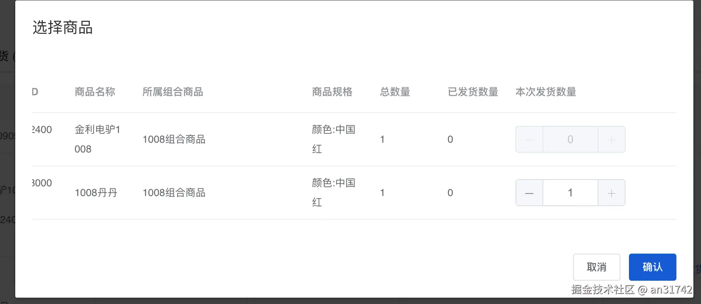

之前通过多级动态表单获取到多包裹，接下来就是再根据多包裹来判断可选择发货数量
**要结合之前的多级表单动态添加包裹会更好理解**

目前这个只是一种方法，我相信还有别的方法，可能会更简单

#### 选择商品

*   选择商品里面选择可选择发货数量，
    *   可选择的发货数量是总数量-每个包裹选择的当前商品的数量-已发货数量
*   可选择发货数量为0时禁用
*   默认展开时全选商品
*   默认展开时可选择商品数默认展示

#### 展示



#### 思路

*   只要把可选择商品把选择商品的数量解决来其他的都好说
    *   复选框的禁用
    *   商品可选择的数量
    *   商品最大值最小值的范围

*   还有一个就是默认展示 这个只要根据element 的toggleRowSelection方法就可以默认全选选中了

#### 页面代码

```
      <BaseDialog title="选择商品" v-model="goodsModel" @close="closegoodGroup">
        <div>
          <el-table
            ref="shopTable"
            :data="newTableData"
            style="width: 100%"
            @selection-change="handleSelectionChange"
            :row-key="getRowKey"
          >
            <el-table-column
              type="selection"
              :selectable="selected"
              :reserve-selection="true"
              width="55"
            ></el-table-column>
            <el-table-column label="SKUID" prop="outerSkuId"></el-table-column>
            <el-table-column label="商品名称" prop="skuName"></el-table-column>
            <el-table-column label="所属组合商品" prop="packageSkuName" width="200">
            </el-table-column>
            <el-table-column
              v-if="!subDeliver"
              label="商品规格"
              prop="specs"
            ></el-table-column>
            <el-table-column
              v-if="!subDeliver"
              label="总数量"
              prop="number"
            ></el-table-column>
            <el-table-column
              v-if="!subDeliver"
              label="已发货数量"
              prop="hadDeliveryNumber"
            ></el-table-column>
            <el-table-column
              v-if="!subDeliver"
              label="本次发货数量"
              prop=""
              width="200"
            >
              <template #default="{ row, $index }">
                <el-input-number
                  :disabled="getMaxNumber(row) === 0 ? true : false"
                  :max="getMaxNumber(row, $index)"
                  :min="0"
                  v-model="row.theSendGoods"
                ></el-input-number>
              </template>
            </el-table-column>
          </el-table>
        </div>
        <template #footer>
          <div class="dialog-footer">
            <el-button type="default" @click="closegoodGroup">取消</el-button>
            <el-button type="primary" @click="submitGood">确认</el-button>
          </div>
        </template>
      </BaseDialog>
```

#### 逻辑代码

```
    export default {
     name: '',
     props: {
       subDeliver: {
         type: Boolean,
         default: null,
       },
       goodsModel: {
         type: Boolean,
         default: null,
       },
       newGoodList: {
         type: Array,
         default: () => {
           return []
         },
       },
     },

     data() {
       return {
         // goodsModel: false, // 选择商品弹框
         pitchData: [],
         flagNum: false,
         newTableData: [],
         tableData: [],
       }
     },

     watch: {
       tableData: {
         deep: true,
         immediate: true,
         handler(newVal, oldVal) {
           console.log('newVal: ', newVal)
           this.newTableData = JSON.parse(JSON.stringify(newVal))
           this.newTableData.forEach((v) => {
             this.$nextTick(() => {
               v.selectFlagState = false
               v.theSendGoods = this.setSelectNum(v)
               this.$refs.shopTable.toggleRowSelection(v, true)
             })
           })
         },
       },
     },

     methods: {
       selected(row, index) {
         if (this.subDeliver) {
           return true
         } else {
           return this.setSelectNum(row) === 0 ? false : true
         }
       },
       getMaxNumber(row) {
         return this.setSelectNum(row)
       },
       // 返回唯一值
       getRowKey(row) {
         return row.id
       },
       closegoodGroup() {
         // this.goodsModel = false
         this.$emit('closeGood', false)
       },
       submitGood() {
         // this.goodsModel = false

         if (this.pitchData.length > 0) {
           if (this.subDeliver) {
             if (this.flagSelect) {
               this.$emit('subPitchData', this.pitchData)
             } else {
               this.$message.warning('请选择子商品')
               this.$emit('subPitchData', [])
             }
           } else {
             let selectEditData = []
             JSON.parse(JSON.stringify(this.newTableData)).map((i) => {
               i.isCommonProduct = i.packageSkuName ? true : false
               i.isCommonProduct
                 ? (i.newSkuId = i.skuId + i.outerSkuId)
                 : (i.newSkuId = i.skuId)
               this.pitchData.map((v) => {
                 v.isCommonProduct
                   ? (v.newSkuId = v.skuId + v.outerSkuId)
                   : (v.newSkuId = v.skuId)
                 if (v.selectFlagState && v.newSkuId === i.newSkuId) {
                   selectEditData.push({
                     orderItemId: i.id,
                     skuId: i.skuId,
                     skuName: i.skuName,
                     storeOuCode: i.storeOuCode,
                     theSendGoods: i.theSendGoods,
                     number: i.theSendGoods,
                     totalNumber: i.number,
                     outerSkuId: v.outerSkuId,
                     packageSkuName: v.packageSkuName,
                   })
                 }
               })
             })

             try {
               let isHasProduct = selectEditData.every((item) => item.number === 0)
               if (isHasProduct) {
                 throw new Error('请选择商品')
               } else {
               }
               selectEditData = selectEditData.filter((item) => item.number !== 0)
             } catch (error) {
               this.$message.error(error.message)
             }

             this.$emit('pitchData', selectEditData)
           }
         } else {
           this.$message({
             type: 'warning', // success error warning
             message: '请选择商品',
             duration: 2000,
           })
         }
         this.flagSelect = false
       },
       handleSelectionChange(data) {
         this.pitchData = []
         this.pitchData = JSON.parse(JSON.stringify(data)).map((v) => {
           return {
             orderItemId: v.id,
             skuId: v.skuId,
             skuName: v.skuName,
             storeOuCode: v.storeOuCode,
             number: this.subDeliver ? '0' : v.number,
             selectFlagState: true,
             outerSkuId: v.outerSkuId,
             packageSkuName: v.packageSkuName,
             isCommonProduct: v.packageSkuName ? true : false,
           }
         })

         this.flagSelect = this.pitchData.length > 0 ? true : false
       },
       //默认展示最发货数量 及
       setSelectNum(row) {
         // 当前包裹没有商品可选择的商品数量
         let selectCanNumber = 0

         // 有多个包裹那么此商品累计的数量
         let selectNumber = 0

         // 当前包裹有商品可选择的商品数量
         let selectFlagNumber = 0

         // 判断当前包裹是否有商品
         let flagNum = false

         this.newGoodList.forEach((item) => {
           console.log('item: ', item)
           //如果该项目有多个 packageList，则进一步遍历每个包裹
           if (item.packageList.length > 0) {
             item.packageList.forEach((v) => {
               // 对于每个包裹，判断里面是否有商品，如果有 packageSkuList 商品
               // 如果包裹里面有商品
               if (v.packageSkuList.length > 0) {
                 // 遍历每一个商品
                 v.packageSkuList.forEach((value) => {
                   // 如果包裹里面的商品与可选择的表格商品中每一个商品保持一致
                   if (value.skuId == row.skuId) {
                     selectNumber += value.number
                     // 累计其他包裹中该商品的数量
                     // 可选择的商品数量 等于总的商品数量减去已发货数量减去其他包裹的该商品的数量
                     selectFlagNumber =
                       parseInt(row.number) -
                       parseInt(row.hadDeliveryNumber) -
                       parseInt(selectNumber)

                     // 做一步校验如果总数量等于已发货数量，则可选择的数量为0
                     if (
                       selectNumber >=
                       parseInt(row.number) - parseInt(row.hadDeliveryNumber)
                     ) {
                       selectFlagNumber = 0
                     }
                     flagNum = true
                   } else {
                     // 其他包裹中该商品不包含当前表格中的商品

                     // 可选择的商品等总数量的商品减去已发货的商品
                     selectFlagNumber =
                       parseInt(row.number) - parseInt(row.hadDeliveryNumber)
                     // 做一步校验如果总数量等于已发货数量，则可选择的数量为0
                     console.log('selectNumber: ', selectNumber)
                     console.log('row.number: ', row.number)
                     console.log('row.hadDeliveryNumber: ', row.hadDeliveryNumber)

                     if (
                       selectNumber >=
                       parseInt(row.number) - parseInt(row.hadDeliveryNumber)
                     ) {
                       selectFlagNumber = 0
                     } else {
                       // 其他包裹中该商品不包含当前表格中的商品 且总数量减去发货数量不等于0 那么得需要再减去其他包裹已选择的发货数量
                       selectFlagNumber =
                         parseInt(row.number) -
                         parseInt(row.hadDeliveryNumber) -
                         parseInt(selectNumber)
                     }
                     flagNum = true
                   }
                 })
               } else {
                 // 如果包裹里面没有商品 那么可以选择商品数量等于总数量减去已发货的数量
                 selectCanNumber =
                   parseInt(row.number) - parseInt(row.hadDeliveryNumber)
               }
             })
           } else {
             // 如果当前包裹的数量只有一个  那么可以选择的商品等于总数量减去已发货的商品数量
             selectCanNumber =
               parseInt(row.number) - parseInt(row.hadDeliveryNumber)
           }
         })

         if (flagNum) {
           // 如果包裹里面有商品 那么可选择的商品数量就是 selectFlagNumber
           return selectFlagNumber
         } else {
           // 如果包裹里面没有商品 那么可选择的商品数量就是 selectCanNumber
           return selectCanNumber
         }
       },
     },
    }

 ```
